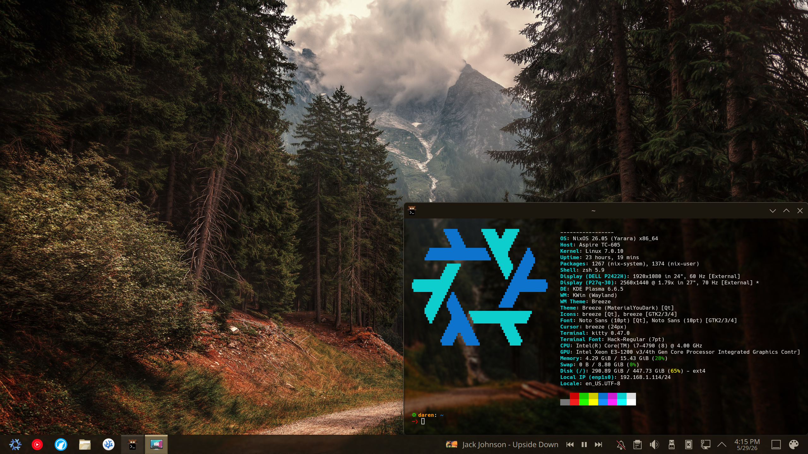

<!-- <h2 align="center"> -->
# DaringT's Nix Config

<div style="text-align: center;">
  
</div>

<br></br>

> [!IMPORTANT]
> 👷‍♂️ This config is a work in progress. KDE Plasma UI and shortcuts in plasma-manager is a work in progress.

> [!WARNING]
> It is highly recommended to review the configuration contents and make necessary modifications to customize it to your needs before attempting the installation.


## 📓 Components


| Component | Application |
| :-- | :-- |
| 🖥️ **Desktop Environment** | [KDE Plasma 6](https://kde.org/plasma-desktop/) |
| 🐱 **Terminal Emulator** | [Kitty](https://sw.kovidgoyal.net/kitty/) |
| 🐚 **Shell** | [zsh](https://www.zsh.org/) -  [Starship](https://starship.rs/) |
| 📝 **Text Editor** | [VSCodium](https://vscodium.com/) |
| 🌐 **Network Manager** | [NetworkManager](https://networkmanager.dev/) |
| 🛰️ **Remote Access** | [RustDesk](https://rustdesk.com/) - [Remmina](https://remmina.org/) |
| 🔤 **Fonts** | [JetBrains Mono Nerd Font](https://www.nerdfonts.com/font-downloads) |
| 🎨 **Icons** | [Breeze Dark](https://invent.kde.org/frameworks/breeze-icons) |
| 🎵 **Media Players** | [Elisa](https://apps.kde.org/elisa/) - [mpv](https://mpv.io/) - [VLC](https://www.videolan.org/vlc/) |
| ▶️ **YouTube Music** | [Pear Desktop](https://github.com/SujitSah/pear-desktop) |
| 🎬 **Video Tools** | [MKVToolNix](https://mkvtoolnix.download/) - [MakeMKV](https://www.makemkv.com/) - [HandBrake](https://handbrake.fr/) |
| 🎧 **Music Tools** | [Mp3tag](https://www.mp3tag.de/en/) |
| 📄 **Office Suite** | [OnlyOffice](https://www.onlyoffice.com/) |
| 🍷 **Wine Tools** | [Bottles](https://usebottles.com/) |
| 💬 **Discord Client** | [Vesktop](https://vesktop.dev/) |


## How to pull down nix config for a test VM
```bash
nix-shell -p git --run "
  cd ~ && \
  git clone https://github.com/DaringT/nix-config.git && \
  cd nix-config && \
  cp /etc/nixos/hardware-configuration.nix ~/nix-config/hosts/VM/hardware-configuration.nix && \
  sudo nixos-rebuild switch --flake .#VM && \
  home-manager switch --flake ~/nix-config#daren
"
```

## TODO

- [ ] 🛠️ Cleaning up NixOS Config.
- [ ] 🛠️ Add *.ssh* to home-manager
- [ ] 🛠️ Add *kde plasma addons* to home-manager
- [ ] 🛠️ Add *kde plasma taskbar icon* to home-manager
- [ ] 🛠️ Add *vscodium* to home-manager
- [ ] 🛠️ Add *vscodium* to home-manager
- [ ] 🛠️ Add *Panel Colorixer* to home-manager
- [ ] 🛠️ Add *PlasMusic Toolbar* to home-manager
- [x] 🛠️ Add *.bashrc* to home-manager
- [x] 🛠️ Add *.zsh* to home-manager
- [x] 🛠️ Add *.gitconfig* to home-manager
- [ ] 📀 Add a backup systyem to NAS server
- [ ] 🎵 Setting up Mp3Tags with wine in a flake. **With Mp3Tags Config's**
- [x] 💬 Setting up nerd fonts
- [x] 🗃️ - 🎵Dolphin config with converting to "Convert to MP3"
- [ ] 🖥️ - 🖥️ Lock 2 monitors wallpapers to be the same thing
- [x] ⚠️ 🐺 Warning: LibreWolf addon's don't add in NixOS config.
- [ ] 🏞️ - 📦 (Optional) Pulling Wallpapers from Reddit: RedPapper NEEDS KDE SUPPORT
- [x] bat instead of cat
